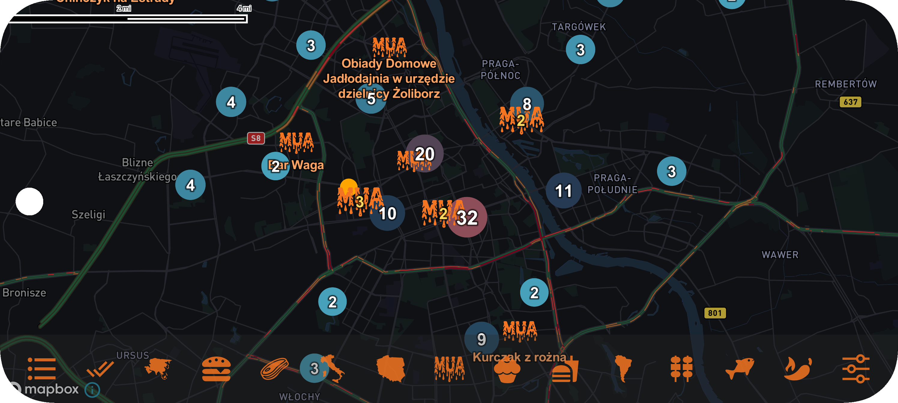

# 👋 Welcome to My Profile!

I'm **Dawid Gajownik**, an aspiring Python, C, Kotlin, Java Developer seeking my first opportunity in the IT industry

## 📂 My Projects

<table>
  <tr>
    <td width="50%" valign="top">
      <h3><a href="https://github.com/DawidGajownik/fdf">FDF — Fil de Fer</a></h3>
      
A program that displays a height map in three-dimensional and spherical views.

      
    </td>
    <td width="50%" valign="top">
      <h3><a href="https://github.com/DawidGajownik/A-Maze-ing">A_maze_ing</a></h3>
      
An application showing step by step maze creation and path finding algorithm with extra features like game mode, brick texture, and heart shape maze.

      
    </td>
  </tr>

  <tr>
    <td width="50%" valign="top">
      <h3><a href="https://github.com/DawidGajownik/fly-in">Fly-in</a></h3>
      
Algorithm carrying out drones from start to the end with certain rules and visualising whole process.

      
    </td>
    <td width="50%" valign="top">
      <h3><a href="https://play.google.com/store/apps/details?id=dawid.gajownik.mualapp">MUALApp</a></h3>
      
Android app for searching restaurants visited by food-youtubers.

      
    </td>
  </tr>
</table>

- [TakeMyBike](https://github.com/DawidGajownik/TakkeMyBike)  
  An application that enables bike reservations between private individuals. Designed with users in mind, it features an intuitive interface and advanced search capabilities.
- [PortfolioLabCharity](https://github.com/DawidGajownik/portfolioLabCharity)  
  A platform supporting charity campaigns, making it easy to create and manage fundraising initiatives.
- [BookIt!](https://github.com/DawidGajownik/Book-It-)  
  (in progress...) A service booking system with advanced filtering and search functionality, including location, price range, and other criteria.

## 🛠️ Technologies
- **Backend:** Python, C, Java, Kotlin, Spring Boot, Hibernate, REST API
- **Frontend:** HTML, CSS, JavaScript, Thymeleaf
- **Databases:** MySQL, Firestore
- **Others:** Google Maps API, Google Translate API, Android Compose

## 🔍 My Approach
- 🌟 I create search and filtering systems that genuinely improve user experience.
- 💡 I consider projects from the user's perspective to ensure maximum usability.
- 🛠️ I value high-quality code and precision in implementation.

## 📫 Contact
- 📧 Email: [dawidgajownik6@gmail.com](mailto:dawidgajownik6@gmail.com)
- 💼 LinkedIn: [Dawid Gajownik](https://www.linkedin.com/in/dawid-gajownik)
